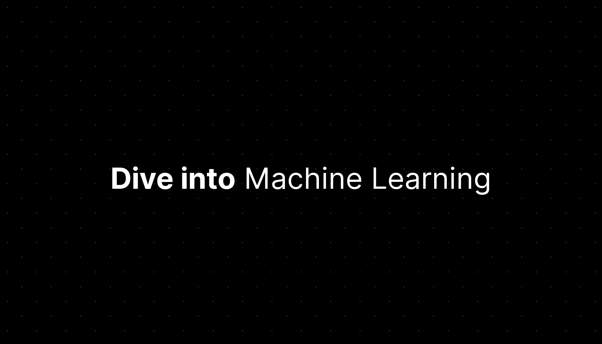

* **[SupportUkraineNow.org — "Real ways you can help Ukraine"](https://supportukrainenow.org)**

----

### Initiatives

Before we [dive in](#dive-into-machine-learning), here are some notable projects and initiatives that might interest you as well.

#### Related to machine learning

* [AlgorithmWatch](https://algorithmwatch.org/en/) — [newsletter](https://algorithmwatch.org/en/newsletter/) — "a non-profit research and advocacy organization that is committed to watch, unpack and analyze automated decision-making (ADM) systems and their impact on society."
* [`daviddao/awful-ai`](https://github.com/daviddao/awful-ai) — "Awful AI is a curated list to track current scary usages of AI — hoping to raise awareness"
* [`humanetech-community/awesome-humane-tech`](https://github.com/humanetech-community/awesome-humane-tech) — "Promoting solutions that improve wellbeing, freedom and society"

#### Code against climate change

* [`ProjectDrawdown/solutions`](https://github.com/ProjectDrawdown/solutions) — [Project Drawdown](https://www.drawdown.org/) — "Project Drawdown entered the climate conversation with the publication of the 2017 book. With The Drawdown Review in 2020, the project continues its mission to inspire and communicate solutions." Python and Jupyter Notebooks.
* [`philsturgeon/awesome-earth`](https://github.com/philsturgeon/awesome-earth)
* [`daviddao/code-against-climate-change`](https://github.com/daviddao/code-against-climate-change)
* [`protontypes/open-sustainable-technology`](https://github.com/protontypes/open-sustainable-technology)

----

# Dive into Machine Learning

Hi there! You might find this resource helpful if:

* You know Python or [you're](https://github.com/alexmojaki/futurecoder) [learning](https://nbviewer.org/github/jakevdp/WhirlwindTourOfPython/blob/master/Index.ipynb) [it](https://github.com/vinta/awesome-python#resources) [:snake:](https://github.com/ossu/computer-science#introduction-to-programming)
* You're new to [Machine Learning](https://en.wikipedia.org/wiki/Machine_learning)
* You care about [the ethics of ML](https://github.com/EthicalML/awesome-artificial-intelligence-guidelines)
  * **[8 Responsible Machine Learning Principles](https://ethical.institute/principles.html)**
  * [Open Ethics Canvas](https://openethics.ai/canvas/)
* You learn by doing

For some great alternatives, [jump to the end](https://github.com/hangtwenty/dive-into-machine-learning#more-ways-to-dive-into-machine-learning) or [check out Nam Vu's guide, Machine Learning for Software Engineers](https://github.com/ZuzooVn/machine-learning-for-software-engineers).

Of course, there is no easy path to expertise. Also, _I'm not an expert!_ I just want to connect you with some great resources _from_ experts. Applications of ML are all around us. I think it's in the public interest for more people to learn more about ML, especially hands-on, because there are many different ways to learn.

Whatever motivates _you_ to dive into machine learning, if you know a bit of Python, these days you can get hands-on with a machine learning _"Hello World!"_ in minutes.

# Let's get started

## Tools you'll need

### If you prefer local installation

* [Python](https://www.python.org/). Python 3 is the best option.
* [Jupyter Notebook](https://jupyter.org/). (Formerly known as IPython Notebook.)
* Some scientific computing packages:
  * numpy
  * pandas
  * scikit-learn
  * matplotlib

You can install Python 3 and all of these packages in a few clicks with the [Anaconda Python distribution](https://www.anaconda.com/download/). Anaconda is popular in Data Science and Machine Learning communities. (Use whichever tool works for you. [If you're unsure or need more context about using conda/virtualenv/poetry/pipenv, here's a very helpful guide](https://web.archive.org/web/20211226071314/https://brainsteam.co.uk/2021/04/01/opinionated-guide-to-virtualenvs/))

### Cloud-based options

Some options you can use from your browser:

- **[Binder](https://mybinder.org/) is Jupyter Notebook's official choice to [try JupyterLab](https://jupyter.org/try)**
- [Deepnote](https://deepnote.com/) allows for real-time collaboration
- [Google Colab](https://colab.research.google.com/) provides "free" GPUs

For other options, see:

- [markusschanta/awesome-jupyter, "Hosted Notebook Solutions"](https://github.com/markusschanta/awesome-jupyter#hosted-notebook-solutions)
- [ml-tooling/best-of-jupyter, "Notebook Environments"](https://github.com/ml-tooling/best-of-jupyter)

## Let's go!

**[Learn how to use Jupyter Notebook](http://opentechschool.github.io/python-data-intro/core/notebook.html) (5-10 minutes).** (You can [learn by screencast](https://www.youtube.com/watch?v=qb7FT68tcA8) instead.)

Now, follow along with this brief exercise: **[An introduction to machine learning with scikit-learn](http://scikit-learn.org/stable/tutorial/basic/tutorial.html)**. Do it in `ipython` or a Jupyter Notebook, coding along and executing the code in a notebook.

### What just happened?

You just classified some hand-written digits using [scikit-learn](http://scikit-learn.org/stable/index.html). Neat huh?

# Dive in

## A Visual Introduction to Machine Learning

Let's learn a bit more about Machine Learning, and a couple of common ideas and concerns. Read ["A Visual Introduction to Machine Learning, Part 1"](http://www.r2d3.us/visual-intro-to-machine-learning-part-1/) by [Stephanie Yee](https://twitter.com/stephaniejyee) and [Tony Chu](https://twitter.com/tonyhschu/).

It won't take long. It's a beautiful introduction ... Try not to drool too much!

## "A Few Useful Things to Know about Machine Learning"

OK. Let's dive deeper.

Read **["A Few Useful Things to Know about Machine Learning"](http://homes.cs.washington.edu/~pedrod/papers/cacm12.pdf)** by [Prof. Pedro Domingos](https://homes.cs.washington.edu/~pedrod/). It's densely packed with valuable information, but not opaque. (Don't worry if you don't understand it all yet.) Take some time with this one.

## Jargon note

* [What is the difference between Data Analytics, Data Analysis, Data Mining, Data Science, Machine Learning, and Big Data?](http://www.quora.com/What-is-the-difference-between-Data-Analytics-Data-Analysis-Data-Mining-Data-Science-Machine-Learning-and-Big-Data-1)
* Another handy term: ["Data Engineering."](https://www.coursera.org/articles/what-does-a-data-engineer-do-and-how-do-i-become-one)
  * ["MLOps"](https://ml-ops.org/) overlaps with Data Eng, and there's [an introductory MLOps section later in this guide](#production-deployment-mlops).

----

## Explore another notebook

Next, code along with one or more of these notebooks.

- Series of notebooks:
  - **2022:** [`rasbt/machine-learning-book`](https://github.com/rasbt/machine-learning-book) — notebooks from [_Machine Learning with PyTorch and Scikit-Learn_ by Sebastian Raschka, Yuxi (Hayden) Liu, and Vahid Mirjalili](https://sebastianraschka.com/blog/2022/ml-pytorch-book.html)
- [Dr. Randal Olson's Example Machine Learning notebook](https://github.com/rhiever/Data-Analysis-and-Machine-Learning-Projects/blob/master/example-data-science-notebook/Example%20Machine%20Learning%20Notebook.ipynb): "let's pretend we're working for a startup that just got funded to create a smartphone app that automatically identifies species of flowers from pictures taken on the smartphone.  We've been tasked by our head of data science to create a demo machine learning model that takes four measurements from the flowers (sepal length, sepal width, petal length, and petal width) and identifies the species based on those measurements alone."
  - [Launch in Binder, no installation steps required](https://mybinder.org/v2/gh/rhiever/Data-Analysis-and-Machine-Learning-Projects/master?filepath=example-data-science-notebook%2FExample%20Machine%20Learning%20Notebook.ipynb)
- Various topical notebooks:
  - [trekhleb/machine-learning-experiments](https://github.com/trekhleb/machine-learning-experiments)
  - [trekhleb/homemade-machine-learning](https://github.com/trekhleb/homemade-machine-learning)

Find more great Jupyter Notebooks when you're ready:

* **[Jupyter's official Gallery of Interesting Jupyter Notebooks: Statistics, Machine Learning and Data Science](https://github.com/jupyter/jupyter/wiki)** ([permalink](https://github.com/jupyter/jupyter/wiki/A-gallery-of-interesting-Jupyter-Notebooks/ae03c01ed25024aa06a4479ea600895d59b38bc4))

----

# Immerse yourself

Pick one of the courses below and start on your way.

## [Prof. Andrew Ng's _Machine Learning_ on Coursera](https://www.coursera.org/learn/machine-learning)

**[Prof. Andrew Ng's](https://hai.stanford.edu/people/andrew-ng) [_Machine Learning_](https://www.coursera.org/learn/machine-learning) is a popular and esteemed free online course. I've seen it [recommended](https://www.quora.com/How-do-I-learn-machine-learning-1/answer/Cory-Hicks-1) [often.](https://www.quora.com/How-do-I-learn-machine-learning-1/answer/Xavier-Amatriain) [And emphatically.](https://www.forbes.com/sites/anthonykosner/2013/12/29/why-is-machine-learning-cs-229-the-most-popular-course-at-stanford/)**

It's recommended to grab a textbook to use as an in-depth reference. The two I saw recommended most often were _[Understanding Machine Learning](https://web.archive.org/web/20210717194345/http://www.cs.huji.ac.il/~shais/UnderstandingMachineLearning/copy.html)_
and _[Elements of Statistical Learning](https://web.stanford.edu/~hastie/Papers/ESLII.pdf)_. [You only need to use one of the two options as your main reference; here's some context/comparison to help you pick which one is right for you.](https://github.com/hangtwenty/dive-into-machine-learning/issues/29)

### Public datasets and pet projects

You might like to have a pet project to play with, on the side. When you are ready for that, you
could explore one of these: [Awesome Public Datasets](https://github.com/caesar0301/awesome-public-datasets), [paperswithcode.com/datasets](https://paperswithcode.com/datasets), [datasetlist.com](https://www.datasetlist.com/), [`KKulma/climate-change-data`](https://github.com/KKulma/climate-change-data#open-data)

### Tips for this course

* [Study tips for Prof. Andrew Ng's course, by Ray Li](https://rayli.net/blog/data/coursera-machine-learning-review/)
* If you're wondering, _Is it still a relevant course?_ or trying to figure out if it fits for you personally, check out these reviews:
  * [Review: Andrew Ng's Machine Learning Course](https://towardsdatascience.com/review-andrew-ngs-machine-learning-course-b905aafdb7d9)
  * [The user reviews on Coursera](https://www.coursera.org/learn/machine-learning/reviews)

### Tips for studying on a busy schedule

It's hard to make time available every week. So, you can try to study more _effectively_ within the time you have available. Here are some ways to do that:

* ["Learning How to Learn" by Barbara Oakley](https://www.coursera.org/learn/learning-how-to-learn/) by Barbara Oakley, a free video course on Coursera.
* Prefer book/audiobook? These are great options:
  * [Barbara Oakley's book _A Mind for Numbers: How to Excel at Math and Science_](https://barbaraoakley.com/books/a-mind-for-numbers) ([reviews](https://www.goodreads.com/book/show/18693655-a-mind-for-numbers)) — "We all have what it takes to excel in areas that don't seem to come naturally to us at first"
  * [_Make It Stick: the Science of Successful Learning_](https://www.retrievalpractice.org/make-it-stick) ([reviews](https://www.goodreads.com/book/show/18770267-make-it-stick))

### Take my tips with a grain of salt

I am not a machine learning expert. I'm just a software developer and these resources/tips were useful to me as I learned some ML on the side.

## Other courses

* **Data science courses as Jupyter Notebooks:**
  * [Practical Data Science](http://radimrehurek.com/data_science_python/)
  * [Python Data Science Handbook, as Jupyter Notebooks](https://jakevdp.github.io/PythonDataScienceHandbook/)
*  [`microsoft/Data-Science-For-Beginners`](https://github.com/microsoft/Data-Science-For-Beginners) — [added in 2021](https://dev.to/azure/free-data-science-for-beginners-curriculum-on-github-1hme) — "10-week, 20-lesson curriculum all about Data Science. Each lesson includes pre-lesson and post-lesson quizzes, written instructions to complete the lesson, a solution, and an assignment. Our project-based pedagogy allows you to learn while building, a proven way for new skills to 'stick'."
* See also [`microsoft/ML-For-Beginners`](https://github.com/microsoft/ML-For-Beginners)

More free online courses I've seen recommended. (Machine Learning, Data Science, and related topics.)

* Coursera's [Data Science Specialization](https://www.coursera.org/specializations/jhu-data-science)
* [Prof. Pedro Domingos's introductory video series](https://www.youtube.com/playlist?list=PLTPQEx-31JXgtDaC6-3HxWcp7fq4N8YGr). [Prof. Pedro Domingos](https://homes.cs.washington.edu/~pedrod/) wrote the paper ["A Few Useful Things to Know About Machine Learning"](https://homes.cs.washington.edu/~pedrod/papers/cacm12.pdf), which you may remember from earlier in the guide.
* [`ossu/data-science`](https://github.com/ossu/data-science) (see also [`ossu/computer-science`](https://github.com/ossu/computer-science))
* [Stanford CS229: Machine Learning](https://github.com/afshinea/stanford-cs-229-machine-learning)
* [Harvard CS109: Data Science](https://cs109.github.io/2015/)
* [Advanced Statistical Computing (Vanderbilt BIOS8366)](http://stronginference.com/Bios8366/lectures.html). Interactive.
* Kevin Markham's video series, [Intro to Machine Learning with scikit-learn](http://blog.kaggle.com/2015/04/08/new-video-series-introduction-to-machine-learning-with-scikit-learn/), starts with what we've already covered, then continues on at a comfortable place.
* [UC Berkeley's Data 8: The Foundations of Data Science](http://data8.org/) course and the textbook [Computational and Inferential Thinking](https://www.inferentialthinking.com/) teaches critical concepts in Data Science.
* Prof. Mark A. Girolami's [Machine Learning Module (GitHub Mirror).](https://github.com/josephmisiti/machine-learning-module) "Good for people with a strong mathematics background."
* [An epic Quora thread: How can I become a data scientist?](https://www.quora.com/How-can-I-become-a-data-scientist?redirected_qid=59455)
* [`ujjwalkarn/Machine-Learning-Tutorials`](https://github.com/ujjwalkarn/Machine-Learning-Tutorials)
* There are more alternatives linked [at the bottom of this guide](#more-ways-to-dive-into-machine-learning)

## Getting Help: Questions, Answers, Chats

Start with the support forums and chats related to the course(s) you're taking.

Check out [datascience.stackexchange.com](https://datascience.stackexchange.com/) and [stats.stackexchange.com – such as the tag, _machine-learning_.](https://stats.stackexchange.com/questions/tagged/machine-learning) There are some subreddits, like [/r/LearningMachineLearning](https://www.reddit.com/r/learningmachinelearning) and [/r/MachineLearning](https://www.reddit.com/r/machinelearning).

Don't forget about meetups. Also look for chat invitations on project pages and so on.

### Some communities to know about!

* [/r/LearnMachineLearning](https://www.reddit.com/r/learnmachinelearning/)
* [/r/MachineLearning](https://reddit.com/r/MachineLearning)
* [/r/DataIsBeautiful](https://reddit.com/r/DataIsBeautiful)
* [/r/DataScience](https://reddit.com/r/DataScience)
* [Cross-Validated: stats.stackexchange.com](https://stats.stackexchange.com/)
* [`ossu/data-science` has a Discord server and newsletter](https://github.com/ossu/data-science#:~:text=Discord%20server)

## Supplement: Learning Pandas well

You'll want to get more familiar with Pandas.

* **Essential**: [Things in Pandas I Wish I'd Had Known Earlier](http://nbviewer.jupyter.org/github/rasbt/python_reference/blob/master/tutorials/things_in_pandas.ipynb) (as a Jupyter Notebook)
* **Essential**: [10 Minutes to Pandas](http://pandas.pydata.org/pandas-docs/stable/10min.html)
* Another helpful tutorial: [Real World Data Cleanup with Python and Pandas](https://trendct.org/2016/08/05/real-world-data-cleanup-with-python-and-pandas/)
* [Video series from Data School, about Pandas](https://www.youtube.com/playlist?list=PL5-da3qGB5ICCsgW1MxlZ0Hq8LL5U3u9y). "Reference guide to 30 common pandas tasks (plus 6 hours of supporting video)."
* Here are some docs I found especially helpful as I continued learning:
  * [Cookbook](http://pandas.pydata.org/pandas-docs/stable/cookbook.html)
  * [Data Structures](http://pandas.pydata.org/pandas-docs/stable/dsintro.html), esp. [DataFrame](http://pandas.pydata.org/pandas-docs/stable/dsintro.html#dataframe) section
  * [Reshaping by pivoting DataFrames](https://pandas.pydata.org/pandas-docs/stable/user_guide/reshaping.html)
  * [Computational tools](http://pandas.pydata.org/pandas-docs/stable/computation.html) and [StackExchange thread: "What is covariance in plain language?"](https://stats.stackexchange.com/questions/29713/what-is-covariance-in-plain-language)
  * [Group By (split, apply, and combine DataFrames)](http://pandas.pydata.org/pandas-docs/stable/groupby.html)
  * [Visualizing your DataFrames](https://pandas.pydata.org/pandas-docs/stable/user_guide/visualization.html)
* Bookmarks for scaling `pandas` and alternatives
  * [`dask`](https://dask.org/): A Pandas-like interface, but for larger-than-memory data and "under the hood" parallelism.
  * [`vaex`](https://vaex.io): "Out-of-Core hybrid Apache Arrow/NumPy DataFrame for Python, ML, visualize and explore big tabular data at a billion rows per second"

## Supplement: Troubleshooting

These debugging tools can be used inside (or outside) a Jupyter notebook:

* [`birdseye`](https://birdseye.readthedocs.io/en/latest/integrations.html#jupyter-ipython-notebooks),
  [`snoop`](https://github.com/alexmojaki/snoop)
* [`pandas-log`](https://github.com/eyaltrabelsi/pandas-log.git)

There are many more tools than that, but those might get you started, or might be
especially useful while you're learning. Beyond learning, troubleshooting is more than just
logs or debuggers, of course... [there's also some MLOps links, later in this guide](#production-deployment-mlops).

# Assorted Tips and Resources

### Risks - some starting points

"Machine learning systems automatically learn programs from data." Pedro Domingos, in ["A Few Useful Things to Know about Machine Learning."](http://homes.cs.washington.edu/~pedrod/papers/cacm12.pdf) The programs you generate will require maintenance. Like any way of creating programs faster, you can rack up [technical debt](https://en.wikipedia.org/wiki/Technical_debt).

Here is the abstract of [Machine Learning: The High-Interest Credit Card of Technical Debt](https://research.google/pubs/pub43146/):

> Machine learning offers a fantastically powerful toolkit for building complex systems quickly. This paper argues that it is dangerous to think of these quick wins as coming for free. Using the framework of technical debt, we note that it is remarkably easy to incur massive ongoing maintenance costs at the system level when applying machine learning. The goal of this paper is highlight several machine learning specific risk factors and design patterns to be avoided or refactored where possible. These include boundary erosion, entanglement, hidden feedback loops, undeclared consumers, data dependencies, changes in the external world, and a variety of system-level anti-patterns.

If you're reading this guide, you should read that paper. You can also [listen to a podcast episode interviewing one of the authors of this paper](https://softwareengineeringdaily.com/2015/11/17/machine-learning-and-technical-debt-with-d-sculley/).

* **[Awesome Production Machine Learning](https://github.com/EthicalML/awesome-production-machine-learning), "a curated list of awesome open source libraries to deploy, monitor, version and scale your machine learning."** It includes a section about [privacy-preserving ML](https://github.com/EthicalML/awesome-production-machine-learning#privacy-preserving-machine-learning), by the way!
* **["Rules of Machine Learning: Best Practices for [Reliable] ML Engineering,"](http://martin.zinkevich.org/rules_of_ml/rules_of_ml.pdf)** by Martin Zinkevich, regarding ML engineering practices.
* [The High Cost of Maintaining Machine Learning Systems](http://www.kdnuggets.com/2015/01/high-cost-machine-learning-technical-debt.html)
* [Overfitting vs. Underfitting: A Conceptual Explanation](https://towardsdatascience.com/overfitting-vs-underfitting-a-conceptual-explanation-d94ee20ca7f9)
* [11 Clever Methods of Overfitting and How to Avoid Them](http://hunch.net/?p=22)
* ["So, you want to build an ethical algorithm?" An interactive tool to prompt discussions](https://cdt.info/ddtool/) [(source)](https://github.com/numfocus/algorithm-ethics)

That's not a comprehensive list, of course! They are just some gateways and starting-points. _Know some other resources? Please share them, pull requests are welcome!_

### Peer review

**[OpenReview.net](https://openreview.net/about)** "aims to promote openness in scientific communication, particularly the peer review process."

<em>More about OpenReview.net</em>

> * **Open Peer Review:** We provide a configurable platform for peer review that generalizes over many subtle gradations of openness, allowing conference organizers, journals, and other "reviewing entities" to configure the specific policy of their choice. We intend to act as a testbed for different policies, to help scientific communities experiment with open scholarship while addressing legitimate concerns regarding confidentiality, attribution, and bias.
> * **Open Publishing:** Track submissions, coordinate the efforts of editors, reviewers and authors, and host… Sharded and distributed for speed and reliability.
> * **Open Access:** Free access to papers for all, free paper submissions. No fees.
> * **Open Discussion:** Hosting of accepted papers, with their reviews, comments. Continued discussion forum associated with the paper post acceptance. Publication venue chairs/editors can control structure of review/comment forms, read/write access, and its timing.
> * **Open Directory:** Collection of people, with conflict-of-interest information, including institutions and relations, such as co-authors, co-PIs, co-workers, advisors/advisees, and family connections.
> * **Open Recommendations:** Models of scientific topics and expertise. Directory of people includes scientific expertise. Reviewer-paper matching for conferences with thousands of submissions, incorporating expertise, bidding, constraints, and reviewer balancing of various sorts. Paper recommendation to users.
> * **Open API:** We provide a simple REST API [...]
> * **Open Source:** We are committed to open source. Many parts of OpenReview are already in the [OpenReview organization on GitHub](https://github.com/openreview). Some further releases are pending a professional security review of the codebase.

> * [OpenReview.net](https://openreview.net/) is created by Andrew McCallum’s Information Extraction and Synthesis Laboratory in the College of Information and Computer Sciences at University of Massachusetts Amherst
>
> * [OpenReview.net](https://openreview.net/) is built over an earlier version described in the paper [Open Scholarship and Peer Review: a Time for Experimentation](https://openreview.net/forum?id=xf0zSBd2iufMg) published in the [ICML 2013 Peer Review Workshop](https://openreview.net/group?id=ICML.cc/2013/PeerReview).
>
> * OpenReview is a long-term project to advance science through improved peer review, with legal nonprofit status through Code for Science & Society. We gratefully acknowledge the support of the great diversity of [OpenReview Sponsors](https://openreview.net/sponsors)––scientific peer review is sacrosanct, and should not be owned by any one sponsor.

### Production, Deployment, [MLOps](https://ml-ops.org/)

If you are learning about MLOps but find it overwhelming, these resources might help you get your bearings:

* [MLOps Stack Template](https://valohai.com/blog/the-mlops-stack/) by Henrik Skogström
* [Lessons on ML Platforms from Netflix, DoorDash, Spotify, and more](https://towardsdatascience.com/lessons-on-ml-platforms-from-netflix-doordash-spotify-and-more-f455400115c7) by Ernest Chan in *Towards Data Science*
* [MLOps Stack Canvas](https://ml-ops.org/content/mlops-stack-canvas) at [ml-ops.org](https://ml-ops.org/)

Recommended awesomelists to save/star/watch:

* **[EthicalML/awesome-artificial-intelligence-guidelines](https://github.com/EthicalML/awesome-artificial-intelligence-guidelines)**
* **[EthicalML/awesome-production-machine-learning](https://github.com/EthicalML/awesome-production-machine-learning#privacy-preserving-machine-learning)**
* **[visenger/awesome-ml-model-governance](https://github.com/visenger/Awesome-ML-Model-Governance)**
* **[visenger/awesome-MLOps](https://github.com/visenger/awesome-mlops)**
* **[eugeneyan/applied-ml](https://github.com/eugeneyan/applied-ml)**

### Easier sharing of deep learning models and demos

* 🐣 **[Replicate](https://replicate.com) "makes it easy to share a running machine learning model"**
  * Easily try out deep learning models from your browser
  * The demos link to papers/code on GitHub, if you want to dig in and see how something works
  * The models run in containers built by **[`cog`](https://github.com/replicate/cog),** "containers for machine learning." 
    * It's an open-source tool for putting models into reproducible Docker containers. 
    * You can put models in containers with just Python and YAML.
  * There's an API for Replicate to run predictions for you

----

## Deep Learning

Take note: some experts warn us not to get too far ahead of ourselves, and encourage learning ML fundamentals before moving onto deep learning. That's paraphrasing from some of the linked coursework in this guide — for example, Prof. Andrew Ng encourages building foundations in ML before studying DL. Perhaps you're ready for that now, or perhaps you'd like to get started soon and learn some DL in parallel to your other ML learnings.

When you're ready to dive into Deep Learning, here are some helpful resources.

* **[_Dive into Deep Learning_](https://d2l.ai/) - An interactive book about deep learning** ([view on GitHub](https://github.com/d2l-ai/d2l-en))
  * Quickstart:
    * [Run this book locally, using Jupyter Notebooks](https://d2l.ai/chapter_installation/index.html)
    * [Run this book in your browser, using Google Colab](https://d2l.ai/chapter_appendix-tools-for-deep-learning/colab.html)
  * "The entire book is drafted in Jupyter notebooks, seamlessly integrating exposition figures, math, and interactive examples with self-contained code."
  * "You can modify the code and tune hyperparameters to get instant feedback to accumulate practical experiences in deep learning."

More deep learning links

* **[Prof. Andrew Ng's](https://scholar.google.com/citations?user=mG4imMEAAAAJ&hl=en) [courses on Deep Learning](https://www.coursera.org/specializations/deep-learning)!** There five courses, as part of the [Deep Learning Specialization on Coursera](https://www.coursera.org/specializations/deep-learning). These courses are part of his new venture, [deeplearning.ai](https://www.deeplearning.ai)
  * Some course notes about it: [ashishpatel26/Andrew-NG-Notes](https://github.com/ashishpatel26/Andrew-NG-Notes)
* **[_Deep Learning_](https://www.deeplearningbook.org/), a free book published MIT Press.** By Ian Goodfellow, Yoshua Bengio and Aaron Courville.
  * A notable testimonial for it is here: ["What are the best ways to pick up Deep Learning skills as an engineer?"](https://www.quora.com/What-are-the-best-ways-to-pick-up-Deep-Learning-skills-as-an-engineer)
* [`fastai/fastbook`](https://github.com/fastai/fastbook) by Jeremy Howard and Sylvain Gugger — "an introduction to deep learning, fastai and PyTorch."
* [`explosion/thinc`](https://github.com/explosion/thinc) is an interesting library that wraps **PyTorch**, **TensorFlow** and **MXNet** models.
  * "Concise functional-programming approach to model definition, using composition rather than inheritance."
  * "Integrated config system to describe trees of objects and hyperparameters."
* [paperswithcode.com](https://paperswithcode.com/) — "The mission of Papers with Code is to create a free and open resource with Machine Learning papers, code, datasets, methods and evaluation tables."
* [`labmlai/annotated_deep_learning_paper_implementations`](https://github.com/labmlai/annotated_deep_learning_paper_implementations) — "Implementations/tutorials of deep learning papers with side-by-side notes." 50+ of them! Really nicely annotated and explained.
* [Distill.pub](https://distill.pub/about/) publishes explorable explanations, definitely worth exploring and following!

----

## Collaborate with Domain Experts

Machine Learning can be powerful, but it is not magic.

Whenever you apply Machine Learning to solve a problem, you are going to be working in some specific problem domain. To get good results, you or your team will need "substantive expertise" / "domain knowledge." Learn what you can, for yourself... But you should also **collaborate with experts.** You'll have better results if you collaborate with [subject-matter experts and domain experts](https://en.wikipedia.org/wiki/Subject-matter_expert#Domain_expert_(software)).

### Machine Learning and User Experience (UX)

I couldn't say it better:

> **Machine learning won’t figure out what problems to solve.** If you aren’t aligned with a human need, you’re just going to build a very powerful system to address a very small—or perhaps nonexistent—problem.

That quote is from ["The UX of AI" by Josh Lovejoy](https://design.google/library/ux-ai/). In other words, **[You Are Not The User](https://www.nngroup.com/articles/false-consensus/).** Suggested reading: [Martin Zinkevich's "Rules of ML Engineering", Rule #23: "You are not a typical end user"](https://developers.google.com/machine-learning/guides/rules-of-ml/#human_analysis_of_the_system)

## Skilling up

What are some ways one can practice?

<strong>One way:</strong> competitions and challenges

You need **practice.** [On Hacker News, user olympus commented to say you could use competitions to practice and evaluate yourself](https://news.ycombinator.com/item?id=10508565). [Kaggle](https://www.kaggle.com/competitions) and [ChaLearn](http://www.chalearn.org/) are hubs for Machine Learning competitions. (You can find more competitions [here](https://github.com/paperswithcode/releasing-research-code#results-leaderboards) or [here](https://towardsdatascience.com/12-data-science-ai-competitions-to-advance-your-skills-in-2021-32e3fcb95d8c).)

You also need **understanding.** You should review what Kaggle competition winners say about their solutions, [for example, the "No Free Hunch" blog](http://blog.kaggle.com/). These might be over your head at first but once you're starting to understand and appreciate these, you know you're getting somewhere.

Competitions and challenges are just one way to practice! [Machine Learning isn't just about Kaggle competitions](https://jvns.ca/blog/2014/06/19/machine-learning-isnt-kaggle-competitions).

<strong>Another way:</strong> try doing some practice studies

Here's a complementary way to practice: **do practice studies.**

1. **Ask a question. Start exploring some data.** The ["most important thing in data science is the question"](https://github.com/DataScienceSpecialization/courses/blob/master/01_DataScientistToolbox/03_02_whatIsData/index.Rmd#the-data-is-the-second-most-important-thing) ([Dr. Jeff T. Leek](https://github.com/jtleek)). So start with a question. Then, find [real data](https://github.com/caesar0301/awesome-public-datasets). Analyze it. Then ...
2. **Communicate results.** When you think you have a novel finding, ask for review. When you're still learning, ask in informal communities (some are [linked below](#some-communities-to-know-about)).
3. **Learn from feedback.** Consider [learning in public](https://www.swyx.io/learn-in-public/), it works great for some folks. (Don't pressure yourself yet though! Everybody is different, and it's good to know your learning style.)

How can you come up with interesting questions? Here's one way. Pick a day each week to [look for public datasets](https://github.com/caesar0301/awesome-public-datasets) and write down some questions that come to mind. Also, sign up for [Data is Plural](https://tinyletter.com/data-is-plural), a newsletter of interesting datasets. When a question inspires you, try exploring it with the skills you're learning.

This advice, to do practice studies and learn from review, is based on [a conversation](https://github.com/hangtwenty/dive-into-machine-learning/issues/11#issuecomment-153934120) with [Dr. Randal S. Olson](http://www.randalolson.com/). Here's more advice from Olson, [quoted with permission:](https://github.com/hangtwenty/dive-into-machine-learning/issues/11#issuecomment-154135498)

> I think the best advice is to tell people to always present their methods clearly and to avoid over-interpreting their results. Part of being an expert is knowing that there's rarely a clear answer, especially when you're working with real data.

As you repeat this process, your practice studies will become more scientific, interesting, and focused. Also, [here's a video about the scientific method in data science.](https://101.datascience.community/2012/06/27/the-data-scientific-method/))

More machine learning career-related links

* ["Advice on building a machine learning career and reading research papers by Prof. Andrew Ng"](https://www.kdnuggets.com/2019/09/advice-building-machine-learning-career-research-papers-andrew-ng.html)
* Some links for finding/following interesting papers/code:
  * [Papers With Code](https://paperswithcode.com/) is a popular site to follow, and it can lead you to other resources. [github.com/paperswithcode](https://github.com/paperswithcode)
  * [MIT: Papers + Code](https://mitibmwatsonailab.mit.edu/research/papers-code/) — "Peer-review is the lifeblood of scientific validation and a guardrail against runaway hype in AI. Our commitment to publishing in the top venues reflects our grounding in what is real, reproducible, and truly innovative."
  * [papers.labml.ai/papers/weekly](https://papers.labml.ai/papers/weekly), [monthly](https://papers.labml.ai/papers/monthly/)
* Pull requests welcome!

---

## More Data Science materials

Here are some additional Data Science resources:

* **[Python Data Science Handbook, as Jupyter Notebooks](https://jakevdp.github.io/PythonDataScienceHandbook/)**
* [`r0f1/datascience`](https://github.com/r0f1/datascience) — "A curated list of awesome resources for practicing data science using Python, including not only libraries, but also links to tutorials, code snippets, blog posts and talks."

### Aside: Bayesian Statistics and Machine Learning

From [the "Bayesian Machine Learning" overview on Metacademy](https://metacademy.org/roadmaps/rgrosse/bayesian_machine_learning):

> ... Bayesian ideas have had a big impact in machine learning in the past 20 years or so because of the flexibility they provide in building structured models of real world phenomena. Algorithmic advances and increasing computational resources have made it possible to fit rich, highly structured models which were previously considered intractable.

Here are some awesome resources for learning Bayesian methods.

* The **free book** _[Probabilistic Programming and Bayesian Methods for Hackers](http://camdavidsonpilon.github.io/Probabilistic-Programming-and-Bayesian-Methods-for-Hackers/)_. Made with a "computation/understanding-first, mathematics-second point of view." Uses [PyMC](https://github.com/pymc-devs/pymc). It's available in print too!
* Like learning by playing? Me too. Try [19 Questions](https://github.com/fulldecent/19-questions), "a machine learning game which asks you questions and guesses an object you are thinking about," and **explains which Bayesian statistics techniques it's using!**
* [_Time Series Forecasting with Bayesian Modeling by Michael Grogan_](https://www.manning.com/liveprojectseries/time-series-forecasting-with-bayesian-modeling), a 5-project series - paid but the first project is free.
* [Bayesian Modelling in Python](https://github.com/markdregan/Bayesian-Modelling-in-Python). Uses [PyMC](https://github.com/pymc-devs/pymc) as well.

[(↑ Back to top)](#dive-into-machine-learning)

----

## More ways to "Dive into Machine Learning"

Here are some other guides to learning Machine Learning.

* [Machine Learning for Software Engineers, by Nam Vu](https://github.com/ZuzooVn/machine-learning-for-software-engineers). In their words, it's a "top-down and results-first approach designed for software engineers." Definitely bookmark and use it. It can answer many questions and connect you with great resources.
* [`ujjwalkarn/Machine-Learning-Tutorials`](https://github.com/ujjwalkarn/Machine-Learning-Tutorials)
* [`josephmisiti/awesome-machine-learning`](https://github.com/josephmisiti/awesome-machine-learning)
* Courses by cloud vendors. These are usually high quality content but steer you heavily to use vendor-specific tools/services. To avoid getting locked into vendor specifics, you can make sure you're learning from other resources as well.
  * [`microsoft/ML-For-Beginners`](https://github.com/microsoft/ML-For-Beginners), [`microsoft/Data-Science-For-Beginners`](https://github.com/microsoft/Data-Science-For-Beginners)
  * [Machine Learning Crash Course from Google](https://developers.google.com/machine-learning/crash-course/) ([more of their options](https://cloud.google.com/training/machinelearning-ai))
  * [Amazon AWS](https://aws.amazon.com/machine-learning/mlu/) ([more of their options](https://aws.amazon.com/machine-learning/learn/))
* **2022:** [_Machine Learning with PyTorch and Scikit-Learn_ by Sebastian Raschka, Yuxi (Hayden) Liu, and Vahid Mirjalili](https://github.com/rasbt/machine-learning-book)

[(↑ Back to top)](#dive-into-machine-learning)
